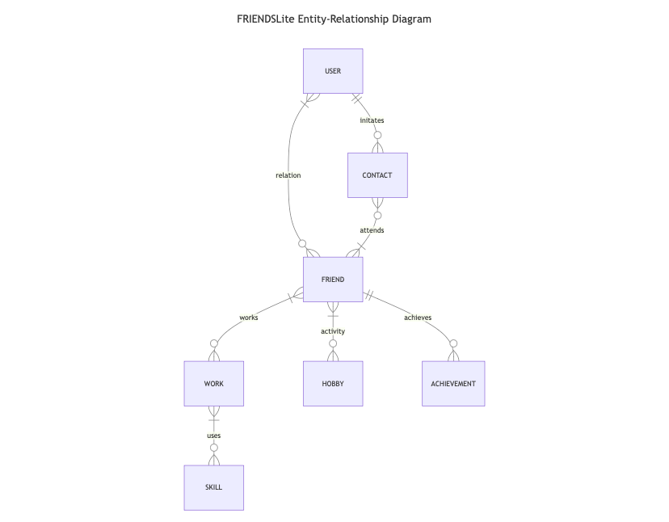

# FRIENDSLite Design Document

Shuo Zheng

Video Overview: [FRIENDSLite](https://youtu.be/UAOpVErEMtg)

## Scope

In the 21st Century, maintaining social networks of friends becomes difficult with respect to work, locality, and time; however, technology can help maintain these networks via video calls and etc. This is a design document for a SQLite database that enables people to maintain their social network of friends by keeping track of interactions so that friendships can last because everyone changes continuously and relations need regular maintainence; otherwise, in a couple of months friends could be nearly unreconizable at a personal level. With respect to scope, the database stores only friends and associated infomation such as name, work, hobbies, dates of interaction, and specific details regarding work and hobbies. Please see the Entity-Relationship Diagram for specification of what exact infomation is to be stored. With respect to design, the database is to only a singular file because the representation is generalizable and a lightweight implementation is desired as a proof of concept.

## Functional Requirements

With respect to the functionality of the database, users can create, read, select, update, and delete infomation about friends. In the representation, users can add friends and infomation in different tables depending on the contents such as work and hobby infomation because daily life can be partitioned into such sets of infomation. On the other hand, storing infomation on nonfriends is outside the scope of the database. Given this interface on the database, storing infomation on friends is the main goal of this application; however, there are certain features left out such as mapping infomation (except their relation status) between friends, but not with users. This is a delibrate choice to encourage mapping a relationship between the user and their friends. In essence, this social network is a collection of tree-structures where the node/vertice represent the user is the root of the graph.

## Representation

### Entities

Given the functionality of social networks defined above, the database stores user, friend, work, and hobby entities to represent the vertices of tree-structure social networks; however, the profession and activity are the entities representing edges between vertices. This is the fundamental structure of these networks; however, additional information relating to friend and work is stored in separate achievement and skill entities. In the user, maintaining name attributes is sufficent to identify a user; hence, the TEXT storage class and NOT NULL constraints are paramount. Similarly, friends store name; however, the scope of the application places great emphasize on a user's relationship with their friends; however, their first and last names are the only specified attibutes within the table and have separate attributes abstracted into different entities such as work and hobbies. Considering the work and hobbies table, the container attributes are identical for both are made to store information about things that friends' do in general; however, work can be hard to understand, so adding a subject attribute enables users to categorize work. Many of these tables include a title and description attribute for entities that are meant to represent work and hobbies, so these attributes are contained within TEXT type and NOT NULL constraints to record information about these professions and achievements. With repect to relations and relationships entites, the intent is to store the status of a friend based upon the user's understand of their relationship with friends. Many of these entities include open-ended attributes to enable, a user to think about their relationship with friends and so where to take that relationship in the future. Similarly, there are profession and achievement tables that join information about friends' work and hobbies to them. Many of these entities exist due to the hope of complete abstraction in order to streamline the thinking of how to translate a mathematical graph interface to a database representation.

### Relationships

Given the entities of social networks defined above, the database relates the entities as follows: user and friend entities have an edge representing their relation; user, friend and contact entities have an edge representing activity between the user and friend; friend and hobby entities are connected via an activity edge; friend and work entities are connected via a profession edge; friend and achievement entities are related by a achieves edge; work and skill entites are connected by a use edge.

## Optimizations

Given the size of the intented database, we have abstracted many pieces of information on friends to different tables so that viewing infomation requires joining table of which views are created for common queries such as the relations with friends, work, and hobbies; however, the implication is that no indexes are to be created for the size of this file database is small.

## Limitations

Given the scope and size of the database, we note that scalability can become an issue after many insertions of users and friends; however, another issue is that of security in that keeping information relating different users and friends because SQLite cannot offer many types with its design, so it is essential ignored. Design and security are the main concerns of this database; however, it was intended to exist as a proof of concept, so a real-world implentation of this design in larger database management systems is privotal to many applications that store information of this nature.
